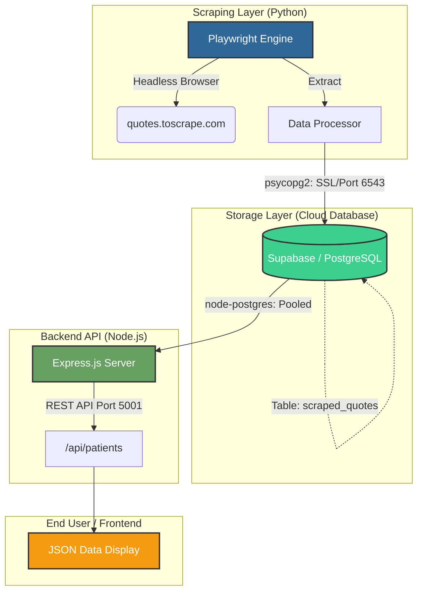

# 🤖 InnoBot Scraper & API System

A complete end-to-end data pipeline: **Scrape** (Python) → **Store** (Supabase) → **Serve** (Node.js).

## 🏛️ System Architecture

This project demonstrates a professional three-tier architecture for automated data collection and distribution.



---

## 🚀 How it Works

### 1. The Scraper (`scrape_quotes.py`)
- **Engine**: Uses Microsoft Playwright to navigate websites.
- **Database**: Connects to Supabase using a **Transaction Pooler** (Port 6543). This bypasses common IPv6 network roadblocks.
- **Resilience**: Features UTF-8 encoding configuration to handle special characters (smart quotes) without crashing in Windows terminals.

### 2. The Backend (`innobot-backend/server.js`)
- **Node.js + Express**: Serves the data stored in the database as a JSON API.
- **Connection Pooling**: Efficiently manages multiple database connections to ensure stability.
- **Security**: Handles SSL handshakes and environment variables for secure cloud connection.

---

## 🛠️ Setup Instructions

### Pre-requisites
- Python 3.x
- Node.js
- A Supabase account

### Step 1: Database Logic
1. Create a project in [Supabase](https://supabase.com).
2. Grab your connection string from **Settings > Database**.

### Step 2: Python Scraper
```powershell
pip install playwright psycopg2-binary
playwright install chromium
python scrape_quotes.py
```

### Step 3: Backend API
1. Navigate to `/innobot-backend`.
2. Create/update `.env` with your `DATABASE_URL`.
3. Run the server:
```powershell
npm install
node server.js
```
The API will be available at: [http://localhost:5001/api/patients](http://localhost:5001/api/patients)

---

## 📁 Project Structure

```text
├── innobot-backend/
│   ├── .env               # Private database credentials
│   ├── server.js          # Express API server
│   └── package.json       # Node.js dependencies
├── scrape_quotes.py       # Python Playwright scraper
├── .gitignore             # Excludes private/temp files
└── README.md              # Project documentation
```

---

## 🛡️ Technical Highlights
*   **Port 6543 Optimization**: Specifically configured to work on IPv4 networks where direct Postgres connections often fail.
*   **SSL Mode**: Configured to work with self-signed certificates for secure cloud-to-local communication.
*   **Cross-Language Integration**: Seamlessly bridges Python (scraping) and JavaScript (serving) using a centralized PostgreSQL database.
